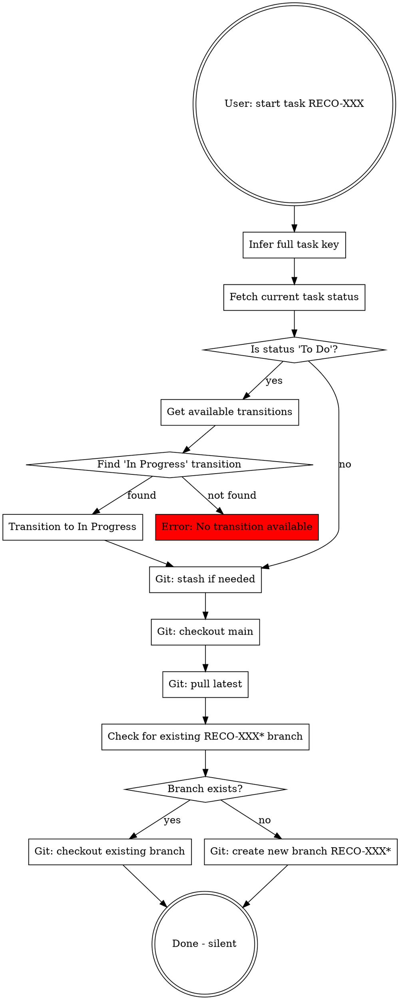

# Starting Jira Tasks

## Overview

"Start task RECO-XXX" means: checkout or create git branch + conditionally transition Jira status to "In Progress" (only if current status is "To Do"). If a branch starting with RECO-XXX already exists, checkout that branch. Otherwise, create a new one.

## The Complete Workflow



## Quick Reference

| User Input | Inferred Task Key |
|------------|-------------------|
| "start task RECO-524" | RECO-524 |
| "start RECO-349" | RECO-349 |
| "start 524" | RECO-524 |
| "begin work on 349" | RECO-349 |

## Implementation Steps

### 1. Get Atlassian Cloud ID

Read cloud ID from environment file:

```bash
grep ATLASSIAN_CLOUD_ID .env | cut -d'=' -f2
```

Store for use in Jira API calls.

### 2. Infer Full Task Key
If user provides just number (e.g., "349"), prepend "RECO-" to get "RECO-349".

### 3. Transition Jira Status (CONDITIONAL)

**Only transition if current status is "To Do".**

Use cloud ID from step 1:

```typescript
// First, fetch current task status
const task = await getJiraIssue({
  cloudId: CLOUD_ID_FROM_STEP_1,
  issueIdOrKey: taskKey
});

// Only transition if status is "To Do"
if (task.fields.status.name === "To Do") {
  // Get available transitions
  const transitions = await getTransitionsForJiraIssue({
    cloudId: CLOUD_ID_FROM_STEP_1,
    issueIdOrKey: taskKey
  });

  // Find "In Progress" transition
  const inProgressTransition = transitions.find(t =>
    t.name === "In Progress"
  );

  if (!inProgressTransition) {
    throw new Error(`No "In Progress" transition available for ${taskKey}`);
  }

  // Execute transition
  await transitionJiraIssue({
    cloudId: CLOUD_ID_FROM_STEP_1,
    issueIdOrKey: taskKey,
    transition: { id: inProgressTransition.id }
  });
}
// If status is NOT "To Do", skip transition and proceed to git workflow
```

### 4. Git Workflow (REQUIRED)

```bash
# Stash uncommitted work if present (only if there are changes)
if [ -n "$(git status --porcelain)" ]; then
  git stash
fi

# Get latest from main
git checkout main
git pull

# Check if branch starting with RECO-XXX already exists (exact match or with suffix)
# This finds: RECO-XXX, RECO-XXX-fix, RECO-XXX-anything
existing_branch=$(git branch --list "RECO-XXX*" | head -1 | sed 's/^[ *]*//')

if [ -n "$existing_branch" ]; then
  # Branch exists - checkout existing branch
  git checkout "$existing_branch"
else
  # Branch doesn't exist - create new branch
  git checkout -b RECO-XXX-descriptive-name
fi
```

**Branch naming:** `RECO-XXX` or `RECO-XXX-descriptive-name` where descriptive-name is kebab-case summary.

**Important:** Only create a new branch if no branch starting with `RECO-XXX` exists. If one exists, checkout that existing branch. The search pattern `RECO-XXX*` (without hyphen after XXX) finds both exact matches (`RECO-XXX`) and branches with suffixes (`RECO-XXX-fix-bug`).

### 5. Silent Completion

**EXACT OUTPUT FORMAT:**
```
Started RECO-XXX on branch RECO-XXX-branch-name
```

**FORBIDDEN OUTPUT:**
- ❌ Task summary/description
- ❌ "The bug involves..." or any task explanation
- ❌ "next steps" or "ready to..."
- ❌ "would you like me to..."
- ❌ Multi-paragraph responses
- ❌ Headers like "## Status Report" or "**Task summary:**"

**If you add ANYTHING beyond the one-line format above, you are violating this skill.**

## Common Mistakes

| Mistake | Fix |
|---------|-----|
| Transition status when NOT "To Do" | Check current status first. Only transition from "To Do" to "In Progress". |
| Create new branch when one exists | Check for existing RECO-XXX* branch first (matches RECO-XXX and RECO-XXX-suffix). Checkout if exists, create if not. |
| Claim status changed without API call | Never lie. Use transitionJiraIssue API when needed. |
| Provide task summary | User already knows the task. Just start it. |
| Ask clarifying questions | User said "start task" - that's clear instruction. |
| Skip git workflow | Git workflow is ALWAYS required. |
| Wrong branch name | Must start with RECO-XXX. |

## Red Flags - STOP

These thoughts mean you're about to violate the skill:

- "Let me get task details to help you start" → NO. Start means transition + branch.
- "I'll fetch the task so you can begin" → NO. Beginning means executing the workflow.
- "Should I transition the status?" → Check current status. Only if "To Do".
- "Do you want me to create a branch?" → Check if RECO-XXX branch exists first. Checkout or create.
- "I should explain what this task is about" → NO. One line output only.
- "The user might want context about the bug" → NO. They asked to START, not explain.
- Writing more than one line of output → STOP. You're violating silent completion.

## Rationalizations That Are Wrong

| Excuse | Reality |
|--------|---------|
| "User just wants task details" | "Start task" means conditional transition + branch. Details are incidental. |
| "I'll help them prepare to start" | Starting = doing the workflow, not preparing. |
| "Status transition isn't part of git workflow" | Conditional transition + git workflow both required for "start task". |
| "I should ask what branch name they want" | Use convention: RECO-XXX-descriptive-name. |
| "Let me check if they meant something else" | "Start task RECO-XXX" is unambiguous. |
| "I should transition regardless of current status" | NO. Only transition from "To Do" to "In Progress". |
| "I'll create a new branch with a better name" | NO. Check for existing RECO-XXX branch first. Use existing if found. |
| "The existing branch might be old/wrong" | NO. If RECO-XXX branch exists, use it. Don't create duplicates. |

## When NOT to Use This Skill

- User asks "what is RECO-XXX about?" → Fetch task details only
- User asks "show me RECO-XXX" → Fetch task details only
- User asks "create branch for RECO-XXX" → Git only, no Jira transition
- User asks "move RECO-XXX to in progress" → Jira transition only, no git

Only use complete workflow when user says "start task" or equivalent phrasing indicating beginning work.